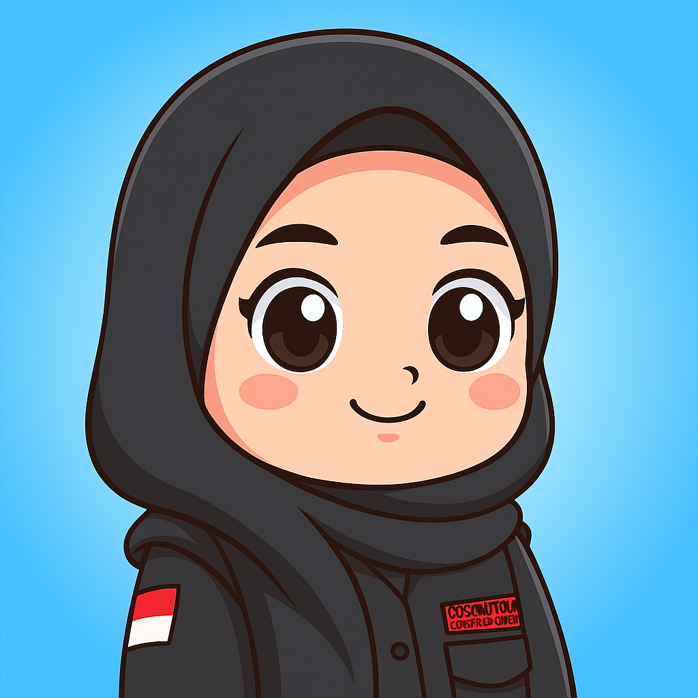
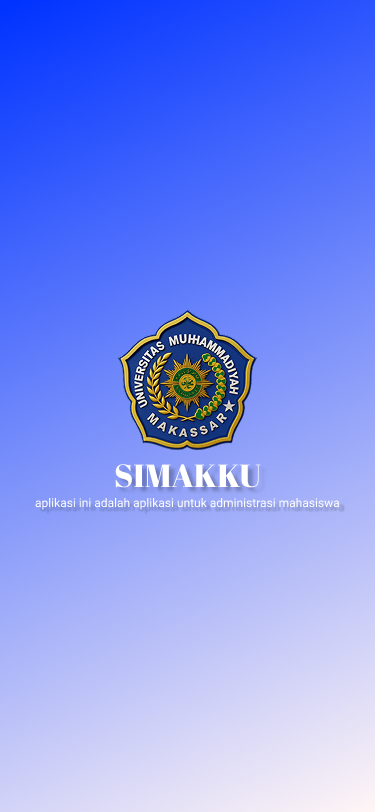
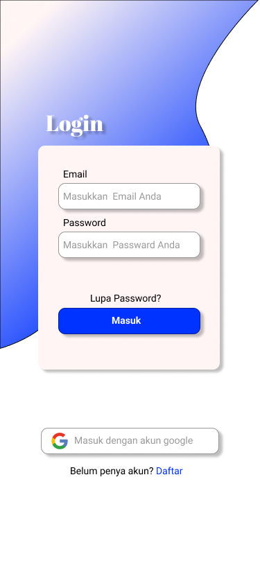
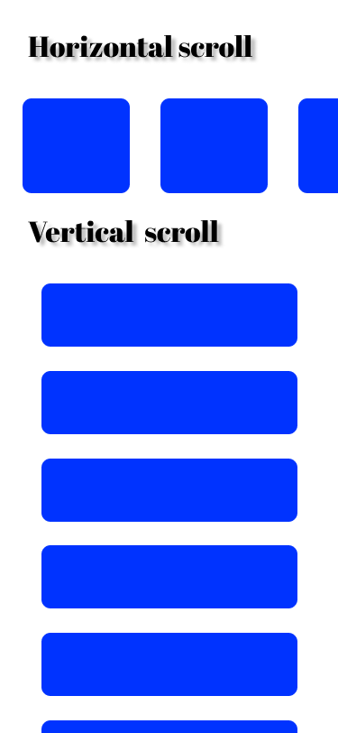

# devcycle_ui-ux
# Latihan UI/UX Desainer - DevCycle

<table>
  <tr>
    <td style="vertical-align: top; padding-right: 20px;">
      Hai 👋  
      Saya <b>Galbi Nadifah</b>, selaku Sekretaris Bidang Keilmuan pada Himpunan Mahasiswa Informatika
      fakultas teknik, sekaligus salah satu tenaga pengajar di <b>DevCycle</b>.   
      Pada kesempatan ini, saya ingin memperlihatkan hasil latihan desain dari kegiatan 
      <b>DevCycle UI/UX Designer</b>.
    </td>
    <td>
      
    </td>
  </tr>
</table>

---

## 🎨 Tentang Desain

Desain ini merupakan latihan pembuatan **tampilan aplikasi mobile** dengan fokus pada penerapan **UI/UX dasar**.  
Beberapa elemen yang dilatih dalam desain ini antara lain:

1. **Tampilan Awal (Splash Screen)**  
   - Menampilkan logo Universitas Muhammadiyah Makassar.  
   - Judul aplikasi: **SIMAKKU** dengan deskripsi singkat "aplikasi ini adalah aplikasi untuk administrasi mahasiswa".  
   - Menggunakan **gradien warna biru** sebagai identitas visual utama.
   - ## 📱 Preview Desain
     

2. **Halaman Login**  
   - Menyediakan input form (Email & Password).  
   - Terdapat tombol *Masuk* serta opsi login menggunakan Google.  
   - Fitur tambahan seperti *Lupa Password* dan *Daftar akun baru* juga ditampilkan.
   -  ## 📱 Preview Desain
     
  
3. **Horizontal Scroll & Vertical Scroll**  
   - Latihan membuat komponen card yang dapat digeser secara horizontal maupun vertikal.
   - Membiasakan penggunaan layout scroll agar konten lebih mudah diakses oleh pengguna.
   - ## 📱 Preview Desain
     

## ✨ Catatan

Latihan ini dibuat sebagai bagian dari kegiatan **DevCycle** untuk mengasah kemampuan dalam **UI/UX Design**, khususnya dalam membangun tampilan aplikasi yang ramah pengguna serta konsisten dalam gaya visual.
link figma : https://www.figma.com/design/OTtBZobY6CEdbWKFY8BTIQ/latihan?node-id=0-1&t=G5WWDY9LSBImT7ES-1
